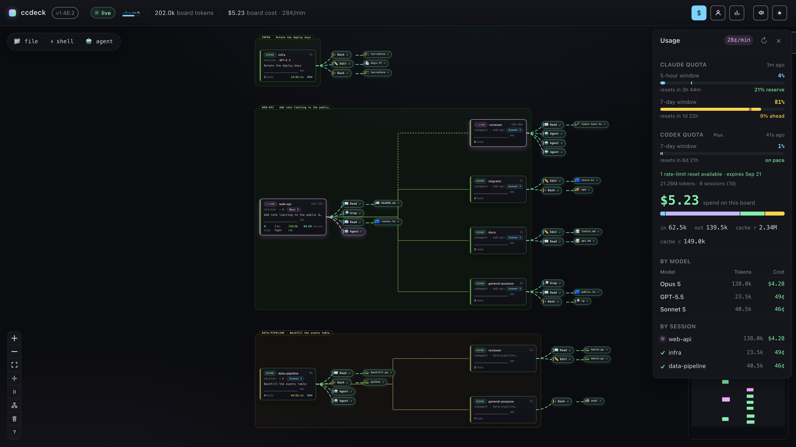

<div align="center">

# ccdeck

**An agent session is a tree. Your terminal shows it as a scroll.**

**ccdeck draws the tree** — Claude Code and OpenAI Codex on one live canvas, with every Claude Code subagent on a node of its own.

[](https://www.npmjs.com/package/ccdeck)
[](https://www.npmjs.com/package/agents-deck)
[](LICENSE)
[](https://nodejs.org)
[](#requirements)

```bash
npx ccdeck
```

[](assets/canvas.png)

*A generated session, drawn by the deck itself — see `assets/canvas-demo.mjs`. Click through for full size.*

tool calls · cost · quota · who is blocked on you · one canvas · local · no telemetry

[What you get](#what-you-get) · [Quick start](#quick-start) · [How it works](#how-it-works) · [What it touches](#what-it-touches) · [Accounts](#accounts) · [Options](#options)


</div>

---

## Why

An agent session is a tree, but a terminal shows it as a scroll. Five subagents working in parallel arrive as one interleaved column of text, and the questions you actually have — *what is running right now, what did that subagent do, which one is stuck, what is this costing* — are the ones the scroll answers worst.

ccdeck draws the tree instead. It is local and needs no configuration: it registers a hook, listens, and paints.

## What you get

One canvas. No tabs. No kanban.

| | |
|---|---|
| **Blocked on you** | A permission prompt or a finished turn waiting for your next instruction sorts that session to the top of the sidebar with how long it has been stuck, and puts a count in the topbar that jumps to the oldest one. Claude Code only — Codex emits no such signal. |
| **Cost and quota, live** | Spend per model and per session, plus Claude and Codex quota windows as they refill. |
| **Live DAG** | Nodes are agents, edges are spawns and tool calls. In-flight edges animate, settled ones fade. |
| **Both providers, one canvas** | Claude Code through hooks, Codex through its rollout log. The model chip (`Opus 5`, `GPT-5.5`) tells them apart. |
| **Click to inspect** | Any node opens its prompt, tool calls, token usage and timing. |
| **Survives restarts** | Events are appended to `~/.claude/agent-dag/events.jsonl` and replayed on open. |
| **Accounts without a terminal** | Sign a new Claude account in, move one or your whole set to another machine, rename, reorder, remove — from the panel. |
| **Knows when it is stale** | Node caches modules at startup, so an upgraded-while-running deck keeps executing old code. This one says so, and can restart itself when nothing is running. |
| **Workspace scoping** | `--scope` for the current directory, `--workspace <path>` for any subtree — for Claude Code and Codex alike. |

## Quick start

```bash
npx ccdeck          # or: npx agents-deck · npx agent-dag — same deck
```

Opens **http://127.0.0.1:4317** and registers the Claude Code hook on first run. If something else already holds 4317, the deck takes a port between 4318 and 4400 instead and prints the address it ended up on — that line in the terminal is the one to trust. Start any Claude Code or Codex session and the graph fills in live. `Ctrl+C` stops it.

No config file. No account. No telemetry — nothing about your sessions is reported anywhere.

What the deck does write, and the short list of what does leave the machine, is in [What it touches](#what-it-touches).

## Requirements

- Node.js ≥ 18 — macOS, Linux and Windows
- Claude Code CLI or OpenAI Codex CLI (or both)
- Optional: [claude-swap](https://pypi.org/project/claude-swap/) for the Accounts panel; the deck can install it for you
- Nothing else. On Apple Silicon the deck fetches [`macmon`](https://github.com/vladkens/macmon) itself for the temperature rows; see below.

### Temperature, per machine

The machine panel shows a **Thermal** section only where the machine actually answers, and it never invents a reading — no sensor means no row.

| | reads | needs |
| --- | --- | --- |
| Linux | `/sys/class/hwmon` | nothing |
| Windows | the `Thermal Zone Information` performance counter | nothing. A machine with no ACPI thermal zone — many desktop boards, and every virtual machine — has nothing to report, and the counter path is currently English-only |
| macOS, Intel | `ioreg` for the GPU, `pmset -g therm` for throttling | nothing |
| macOS, Apple Silicon | `macmon`, which the deck fetches for you | nothing |

Apple Silicon is the one that needs a tool, and it is not an oversight. No command that ships with macOS prints a temperature on an M-series Mac: `powermetrics` needs root, `pmset -g therm` records nothing there, and the sensors sit behind a private API that only native code can call. [`macmon`](https://github.com/vladkens/macmon) reads them without `sudo` and covers M1 through M5.

You do not have to install it. The deck downloads the published binary into `~/.agents-deck/tools/macmon` — the same place it already keeps `uv` — verifies it against the SHA-256 the GitHub release publishes, checks that it runs, and only then uses it. Not through Homebrew, because a machine without Homebrew would need Homebrew installed first, and that is a large thing to do to somebody who asked for a dashboard. It happens in the background, after the deck is already up, and never on the first run's critical path.

It is skipped entirely on a machine that already answers — an Intel Mac never downloads anything — and on one where you have `macmon` yourself, which is found on either Homebrew prefix. `AGENTS_DECK_NO_DOWNLOAD=1` turns it off on its own; `AGENTS_DECK_NO_INSTALL=1` turns it off along with everything else.

## How it works

Two capture paths feed one SSE stream, which feeds one canvas.

**Claude Code** — on first run, ccdeck adds a hook entry to `~/.claude/settings.json` for every relevant event (or to `$CLAUDE_CONFIG_DIR/settings.json`, and every other path below moves with it, when you have that variable set):

```
SessionStart · UserPromptSubmit · PreToolUse · PostToolUse · PostToolUseFailure
SubagentStart · SubagentStop · Stop · SessionEnd · Notification
```

Each one fires the bundled `hook.js`, which POSTs the event JSON to the running server. The hook is fire-and-forget with a 1-second timeout: if the deck is not running, your session is not slowed down and nothing fails.

**OpenAI Codex** — Codex CLI hooks do not fire reliably on Windows, so nothing is installed at all. The server tails Codex's own rollout files at `~/.codex/sessions/YYYY/MM/DD/rollout-*.jsonl` and reconstructs the equivalent stream — session start, prompts, tool calls, token usage, model. No hook install, no trust prompt. Set `CODEX_HOME` to override the path.

Quota is the one thing that is not just reading. It needs a live token, so when the one in `~/.codex/auth.json` is within 90 seconds of expiring the deck refreshes it exactly as the CLI does and writes the rotated credential back — one refresh at a time, re-reading the file inside the lock, and atomically, because OpenAI's refresh tokens are single-use and a rotation that never reaches disk costs you a `codex login`. It happens only while the page is open, and nothing else in `auth.json` is touched.

## What it touches

It never steers an agent or edits your code, but it is not read-only either — besides the hook entry and its own event log, it manages the two tools it leans on, and it refreshes the Codex token it reads quota with, rewriting `~/.codex/auth.json` the way `codex` itself does.

What does go out is short and ordinary: a ~20-byte version check against the npm registry (plus one small request to confirm a version it has not seen before), installs and daily version checks for the two tools the deck manages (claude-swap from PyPI, ccusage from npm), and, while the page is open, quota reads to Anthropic and OpenAI signed with your own credentials — that is where those numbers live. `AGENTS_DECK_NO_INSTALL=1` turns off everything but the quota reads; `AGENTS_DECK_NO_DOWNLOAD=1` is the narrower version — no `uv` binary is fetched, the managed installs stay.

## Accounts

The Accounts panel reads the store [claude-swap](https://pypi.org/project/claude-swap/) keeps, and can drive it.

**`+` → Sign in** runs `claude auth login`, shows you the link, takes the code your browser gives back, and hands the result to `cswap add`. The account you were using **stays active** — signing in replaces the live credentials, so the previous one is switched back the moment the new one is recorded. The code goes straight into the CLI's stdin on this machine; it is never stored, logged, or sent anywhere else.

**`share`** on an account produces a `ccdeck1:…` blob to paste into another deck's **`+` → Paste a share**.

**`↗`** in the panel header does the same for a set of them, which is what moving your accounts from home to work actually is. Tick the ones to send — all of them to start — and one blob carries the set. The dialog counts sign-in tokens rather than rows, and an account that cannot be exported is named rather than quietly dropped, so the number on the copy button is always the number in the blob.

An import adds what is missing and leaves a working account exactly as it is. The one it does rewrite unasked is a slot claude-swap has itself quarantined as refresh-token-dead, which is what heals a machine whose login stopped working. The result names every account in the paste — imported, already here, healed, or refused — and an account it skipped can be overwritten one at a time with **update anyway**.

> [!WARNING]
> A share carries the **live login of every account in it, in the clear** — claude-swap's export format has no encryption, and five ticked boxes is five passwords on your clipboard. It expires ten minutes after it is made and imports refuse it after that. While it lives, treat it as those passwords: anything that can read your clipboard can read the accounts.

Renaming, reordering and removing are on the same row menu. Removal takes two clicks and cannot be undone.

## Options

```
ccdeck [options]

  -p, --port <number>      Preferred port  (default: 4317; fallback: random 4318–4400)
      --no-open            Don't open the browser automatically
      --workspace <path>   Only capture sessions whose cwd is inside <path>
      --scope              Restrict to the current working directory
      --all                Capture every session on this machine  (default)
      --history <path>     Override the events log file
                           (default: ~/.claude/agent-dag/events.jsonl)
      --no-persist         RAM-only mode — don't write or replay the log
      --codex              Force Codex capture even if ~/.codex/ is missing
      --no-codex           Skip Codex capture (Claude only)
      --claude             Force Claude capture even if Claude Code wasn't found
      --no-claude          Skip Claude entirely — no hooks, no claude-swap,
                           no Accounts panel (Codex only)
      --uninstall          Remove ccdeck's hooks from settings files
  -h, --help               Show this help
  -v, --version            Print the version and exit
```

Anything else on the command line is reported as an unknown option and then
ignored — the deck still starts, so a typo costs you a warning rather than a
dashboard.

ccdeck looks for each CLI before it does anything on that CLI's behalf. Claude
Code counts as present when its binary is on `PATH` (or in one of the places its
installers put it), or when its config dir carries traces of having been used;
Codex counts as present when `~/.codex/` exists. On a machine with only one of
them, the other one's hooks, installs and panels are skipped rather than shown
empty — the boot banner says which way it went, and `--claude` / `--codex`
override it if the guess is wrong.

`--workspace` is a filter this deck applies to itself, not a claim on the sessions it matches: **every** running deck whose workspace contains a session's directory draws that session, so a machine-wide deck and one scoped to `~/proj` both show the agents working inside `~/proj`. It reads the same way on all three paths a session can reach the canvas by — Claude Code's hook, Codex's rollout files, and the boot replay of the events log — and the events log still gets exactly one copy of each event, whichever decks are up. A relative path is resolved against the directory you start the deck in, and once, so every path scopes to the same tree. The log is machine-wide by default and shared by every deck on the box, so a scoped deck replays only the part of it that is inside its own workspace: it comes up showing what it will go on to capture, and nothing else.

That one events log is also the reason Clear is not quite the per-deck button it looks like. The decks elect a single writer for each log file, and only that deck may empty it: Clear on any other deck wipes its own canvas and leaves the file to the deck that writes it. The confirmation says which of the two you are about to do, and how many decks share the log when it is yours to empty — so `--history` or `--no-persist` gives a deck a log of its own if you want Clear to answer to nobody else.

Environment:

| Variable | Effect |
|---|---|
| `AGENT_DAG_PORT` | Default port, same as `-p` |
| `CODEX_HOME` | Override `~/.codex` |
| `AGENTS_DECK_NO_INSTALL=1` | Never install or update claude-swap / ccusage, and never ask npm about releases |
| `AGENTS_DECK_NO_DOWNLOAD=1` | Never download the `uv` binary, but keep the managed installs |
| `AGENTS_DECK_NO_UPDATE_CHECK=1` | Don't ask npm about releases, but keep everything else |
| `AGENTS_DECK_NO_FRESHEN=1` | Never nudge claude-swap to collect usage early |
| `AGENTS_DECK_CSWAP` | Full path to `cswap`, when it lives somewhere unusual |
| `AGENTS_DECK_CLAUDE` | Full path to the `claude` CLI |
| `AGENTS_DECK_CCUSAGE` | Full path to your own `ccusage`, used ahead of everything else |
| `CLAUDE_SWAP_BACKUP` | Override the claude-swap store root the Accounts panel reads |

Usage history is read with `ccusage`, and the deck takes the first of these that answers: `AGENTS_DECK_CCUSAGE` if you set it, then the copy it installed for itself under `~/.agents-deck/ccusage`, then a `ccusage` on your PATH, then `npx -y ccusage@latest`. So installing ccusage yourself is enough — the deck will not fetch a second copy, and it works under `AGENTS_DECK_NO_INSTALL=1`, which is the combination that variable is for. When something fails, the modal names which of those four it was.

Being told to restart after an upgrade is local only — no network involved — and cannot be turned off, because a deck running superseded code is a bug you cannot see any other way.

## Uninstall

```bash
npx ccdeck --uninstall
```

Removes every hook entry ccdeck injected from `~/.claude/settings.json`, and `~/.codex/hooks.json` if present.

It removes the hook entries and nothing else. The forwarder script
(`~/.claude/agent-dag/hook.js`), the discovery directory around it, the events
log, and the tools ccdeck installed for you — claude-swap, ccusage, and a `uv`
binary if it had to fetch one — are all left in place, and each has its own
uninstaller. Deleting `~/.claude/agent-dag/` and `~/.agents-deck/` clears
ccdeck's own files; `uv tool uninstall claude-swap` (or `pipx uninstall
claude-swap`) removes the account switcher.

## Updating

The deck checks npm for a newer release at most once an hour, plus once when it starts — a ~20-byte GET to `registry.npmjs.org`, asking about the package this copy would actually install (a deck started with `npx ccdeck` asks about `ccdeck`). When that names a version it has not seen before, one more request confirms the version is really there: npm moves the dist-tag before the version itself has propagated, and a banner shown inside that window ends in `ETARGET` instead of an upgrade. So a check is one request, or two when there is something new to confirm — and a version that is tagged but not yet installable is looked at again in five minutes rather than in an hour. Click the version chip in the topbar to ask immediately.

What the banner offers depends on how this copy was installed:

| Installed as | Offer |
|---|---|
| global npm install | **Update now** — runs `npm install -g` on the name you installed (`ccdeck`, `agents-deck` or `agent-dag`), then restarts once nothing is running |
| `npx` | **Update & restart** — re-runs the spec through npx, which fetches a fresh copy and takes over the same port |
| git checkout | the command, because your working copy leads npm: `git pull && npm run build` |
| directory not writable | the command — a root-owned prefix is declined up front rather than failing inside npm |
| `AGENTS_DECK_NO_INSTALL=1` | the command only; you asked for no installs |

Nothing is ever installed unless you click, the argument vector is fixed in the server rather than taken from the request, and the command is always on screen — button or no button. If npm fails, the banner shows npm's own last line.

### Restarting

ccdeck runs as a two-process pair: a supervisor that owns nothing but the lifecycle, and the deck itself. When newer code is found, the deck exits with code 75 and the supervisor brings it back **on the port it actually bound**, which is not always the one it asked for. Ctrl+C, stdout and exit codes behave exactly as before — same terminal, same process group.

It restarts on its own only after 30 seconds with nothing running, because hook events are fire-and-forget and anything fired during the gap is lost. The toggle in the banner turns that off; the preference is per-browser. Under `--no-persist` a restart is refused outright — with no event log there is nothing to replay, and the canvas would be gone.

## Design

- Node = agent (root session or subagent)
- Edge = parent → child (spawn), or agent → tool (call)
- In-flight animates; settled dims
- Click a node for the full story

## Names

**ccdeck** is the name — of this repo and of the command. On npm it goes out
under three, and `npx` runs the same deck from any of them.

```bash
npx ccdeck        # this repo's name — the short one
npx agents-deck   # the name it shipped under before the rename
npx agent-dag     # the original name; existing installs and scripts keep working
```

The three are one build published three times, so they behave identically:
`npx` on any of them fetches a single package, and `npm i -g` on any of them
puts all three commands on your `PATH`.

`ccdeck` was the exception until recently — a thin package that depended on
`agents-deck` and spawned its binary. It worked, but `npx ccdeck` downloaded two
packages instead of one and a global `ccdeck` ran under the old package's name.
It is now the same build as the other two.

The repository was previously named `agents-deck`; the old URL redirects here,
so existing clones, links and bookmarks keep working.

## License

MIT © [Bargan Constantin](https://github.com/BarganConstantin)
